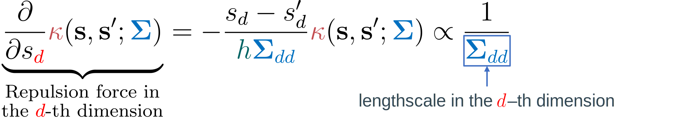
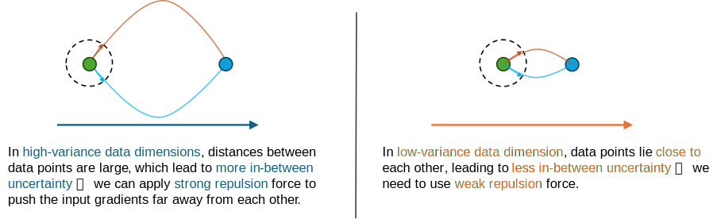
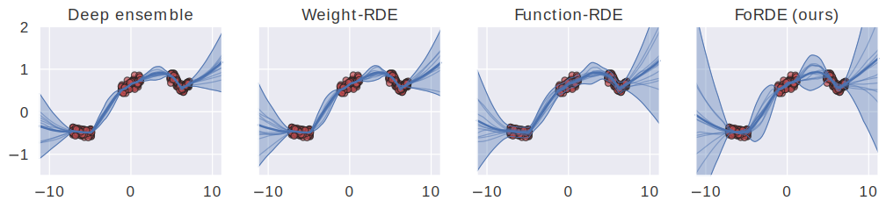
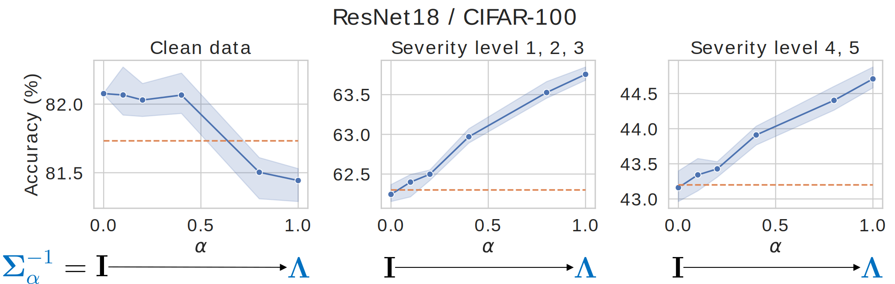
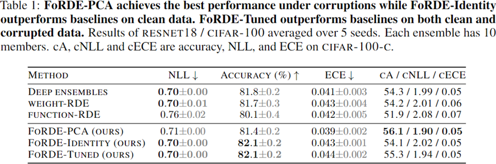
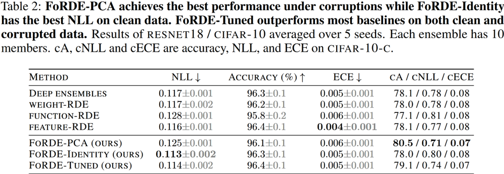
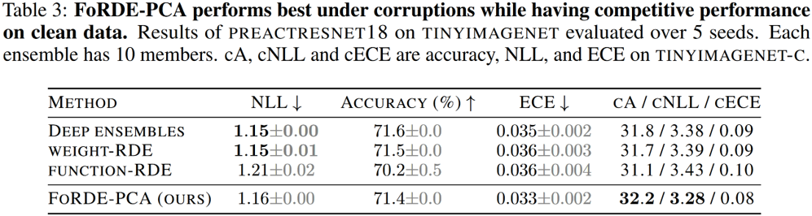

*This website contains information regarding the paper Input-gradient space particle inference for neural network ensembles.*

> **TL;DR**: We introduce First-order Repulsive Deep ensembles (FoRDEs), a method that trains an ensemble of neural networks diverse with respect to their input gradients.

Please cite our work if you find it useful:
```bibtex
@inproceedings{trinh2024inputgradient,
    title={Input-gradient space particle inference for neural network ensembles},
    author={Trung Trinh and Markus Heinonen and Luigi Acerbi and Samuel Kaski},
    booktitle={The Twelfth International Conference on Learning Representations},
    year={2024},
    url={https://openreview.net/forum?id=nLWiR5P3wr}
}
```

# Repulsive deep ensembles (RDEs) [1]

> **Description:** Train an ensemble \\(\\{\boldsymbol{\theta}\_i\\}_{i=1}^M\\) using Wasserstein gradient descent [2], which employs a <span class="my_blue">kernelized repulsion term</span> to diversify the particles to cover the <span class="my_red"> Bayes posterior \\(p(\boldsymbol{\theta} \| \mathcal{D}) \\)</span>. 


- The <span class="my_red">driving force</span> directs the particles towards high density regions of the posterior
- The <span class="my_blue">repulsion force</span> pushes the particles away from each other to enforce diversity.

<strong class="my_orange">Problem:</strong> It is unclear how to define the repulsion term for neural networks:
- Weight-space repulsion is ineffective due to overparameterization and weight symmetries.
- Function-space repulsion often results in underfitting due to diversifying the outputs on training data.

# First-order Repulsive deep ensembles (FoRDEs)


<strong class="my_orange">Possible advantages:</strong>
- Each member is guaranteed to represent a different function;
- The issues of weight- and function-space repulsion are avoided;
- Each member is encouraged to learn different features, which can improve robustness.

# Defining the input-gradient kernel <span class="my_blue">\\(k\\)</span>

Given a base kernel <span class="my_deepred">\\(\kappa\\)</span>, we define the kernel in the input-gradient space for a minibatch of training samples \\(\mathcal{B}=\\{(\mathbf{x}\_b, y\_b\\}\_{b=1}^B\\) as follows:


We choose the <span class="my_orange">RBF kernel</span> on a <span class="my_purple">unit sphere</span> as the base kernel <span class="my_deepred">\\(\kappa\\)</span>:


# Tuning the lengthscale <span class="my_blue">\\(\boldsymbol{\Sigma}\\)</span>

Each <span class="my_blue">lengthscale</span> is inversely proportional to the strength of the repulsion force in the corresponding input dimension:



<div style="margin:0 0 10px 0;" class="my_box"><strong class="my_orange">Proposition:</strong> One should apply <span class="my_blue">strong forces</span> in <span class="my_blue">high-variance dimensions (more in-between uncertainty)</span> and <span class="my_orange">weak forces</span> in <span class="my_orange">low-variance dimensions (less in-between uncertainty)</span>.



</div>

- Use PCA to get the <span class="my_blue">eigenvalues</span> and <span class="my_red">eigenvectors</span> of the training data: \\(\\{ {\color{red}\mathbf{u}\_d},{\color[RGB]{68,114,196}\lambda\_d}\\}\_{d=1}^D\\)
- Define the base kernel:

    - \\( {\color{red}\mathbf{U}} = \begin{bmatrix} {\color{red}\mathbf{u}\_1} & {\color{red}\mathbf{u}\_2} & \cdots & {\color{red}\mathbf{u}\_D} \end{bmatrix} \\) is a matrix containing the <span class="my_red">eigenvectors</span> as columns.
    - \\( {\color[RGB]{68,114,196}\boldsymbol{\Sigma}^{-1}\_{\alpha}} = (1-\alpha)\mathbf{I} + \alpha {\color[RGB]{68,114,196}\boldsymbol{\Lambda} } \\) where \\( \color[RGB]{68,114,196}\boldsymbol{\Lambda} \\) is a diagonal matrix containing the <span class="my_blue">eigenvalues</span>.

# Illustrative experiments




For a 1D regression task (above) and a 2D classification task (below), FoRDEs capture higher uncertainty than baselines in all regions outside of the training data. For the 2D classification task, we visualize the entropy of the predictive posteriors.

# Lengthscale tuning experiments



- <span class="my_blue">Blue lines</span> show accuracies of FoRDEs, while <span class="my_orange">dotted orange lines</span> show accuracies of Deep ensembles for comparison.
- When moving from the identity lengthscale \\(\mathbf{I}\\) to the PCA lengthscale \\(\color[RGB]{68,114,196}\boldsymbol{\Lambda}\\):
    - FoRDEs exhibit small performance degradations on clean images of CIFAR-100;
    - while becomes more robust against the natural corruptions of CIFAR-100-C.

# Benchmark comparison







# Main takeaways

<div class="my_box">
1. Input-gradient-space repulsion can perform better than weight- and function-space repulsion.
2. Better corruption robustness can be achieved by configuring the repulsion kernel using the eigen-decomposition of the training data.
</div>

## References
<p style="font-size: small;">
[1] F. D’Angelo and V. Fortuin, “Repulsive deep ensembles are Bayesian,” Advances in Neural Information Processing Systems, vol. 34, pp. 3451–3465, 2021.
</p>
<p style="font-size: small;">
[2] C. Liu, J. Zhuo, P. Cheng, R. Zhang, and J. Zhu, “Understanding and Accelerating Particle-Based Variational Inference,” in International Conference on Machine Learning, 2019.
</p>