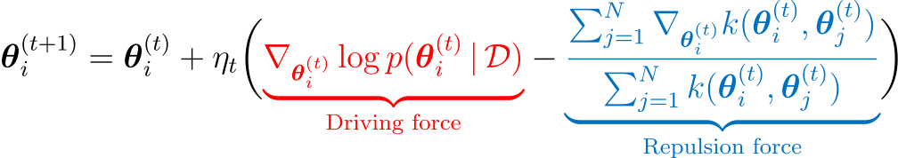
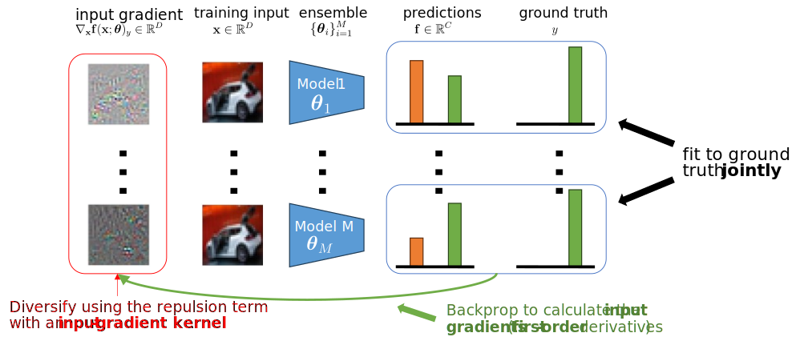
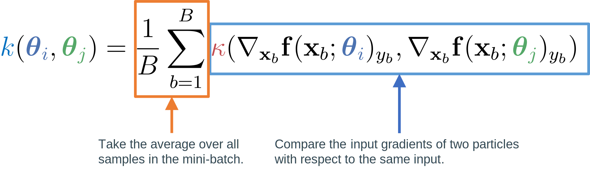
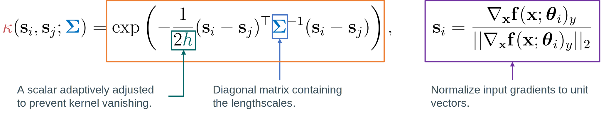

*This website contains information regarding the paper Input-gradient space particle inference for neural network ensembles.*

> **TL;DR**: We introduce First-order Repulsive Deep ensembles (FoRDEs), a method that trains an ensemble of neural networks diverse with respect to their input gradients.

Please cite our work if you find it useful:
```bibtex
@inproceedings{trinh2024inputgradient,
    title={Input-gradient space particle inference for neural network ensembles},
    author={Trung Trinh and Markus Heinonen and Luigi Acerbi and Samuel Kaski},
    booktitle={The Twelfth International Conference on Learning Representations},
    year={2024},
    url={https://openreview.net/forum?id=nLWiR5P3wr}
}
```

# Repulsive deep ensembles (RDEs) [1]

> **Description:** Train an ensemble \\(\\{\boldsymbol{\theta}\_i\\}_{i=1}^M\\) using Wasserstein gradient descent [2], which employs a <span class="my_blue">kernelized repulsion term</span> to diversify the particles to cover the <span class="my_red"> Bayes posterior \\(p(\boldsymbol{\theta} \| \mathcal{D}) \\)</span>. 



- The <span class="my_red">driving force</span> directs the particles towards high density regions of the posterior
- The <span class="my_blue">repulsion force</span> pushes the particles away from each other to enforce diversity.

<strong class="my_orange">Problem:</strong> It is unclear how to define the repulsion term for neural networks:
- Weight-space repulsion is ineffective due to overparameterization and weight symmetries.
- Function-space repulsion often results in underfitting due to diversifying the outputs on training data.

# First-order Repulsive deep ensembles (FoRDEs)



<strong class="my_orange">Possible advantages:</strong>
- Each member is guaranteed to represent a different function;
- The issues of weight- and function-space repulsion are avoided;
- Each member is encouraged to learn different features, which can improve robustness.

# Defining the input-gradient kernel <span class="my_blue">\\(k\\)</span>

Given a base kernel <span class="my_deepred">\\(\kappa\\)</span>, we define the kernel in the input-gradient space for a minibatch of training samples \\(\mathcal{B}=\\{(\mathbf{x}\_b, y\_b\\}\_{b=1}^B\\) as follows:



We choose the <span class="my_orange">RBF kernel</span> on a <span class="my_purple">unit sphere</span> as the base kernel <span class="my_deepred">\\(\kappa\\)</span>:

